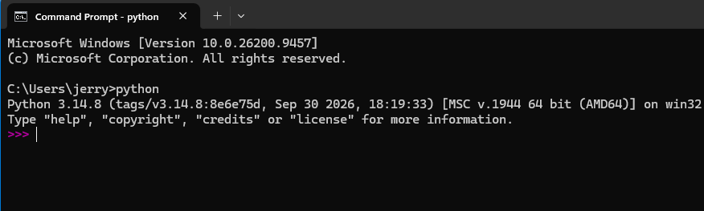
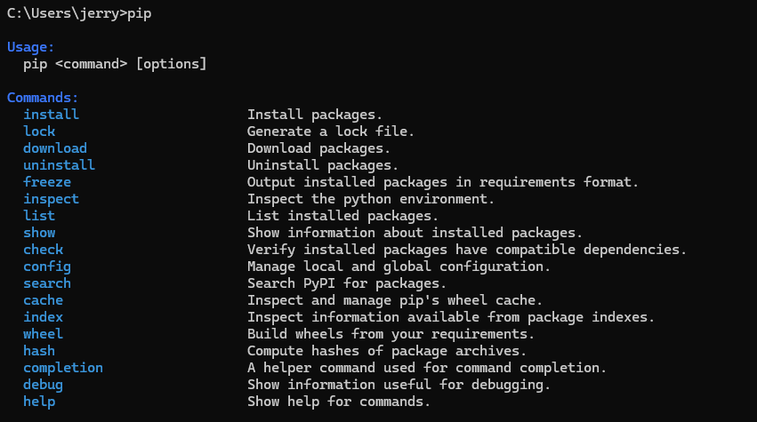
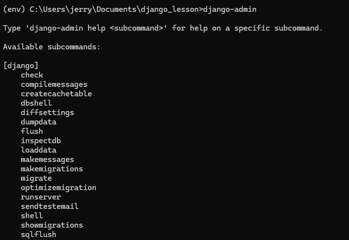
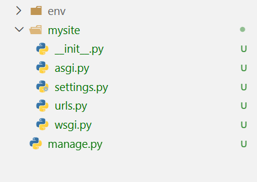
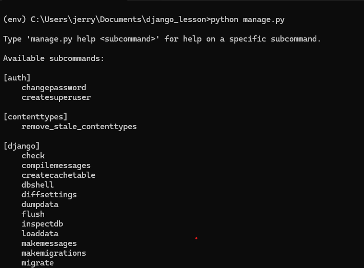
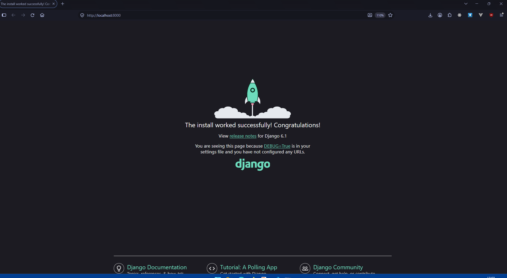
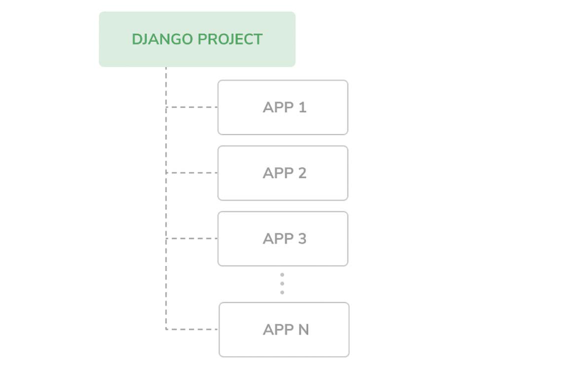
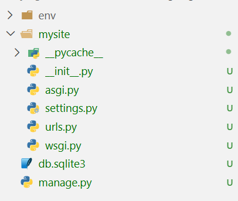

## Installing Django
To get started, you will need to have Python installed. Visit [the official Python website](https://python.org/downloads) and download an installer for your operating system.

### Verify Your Installation
After a successful installation, you will have the `python3` command in your commandline interface.

!!! Note
    We are going to be using the commandline a lot, please do not fret, I will hold your hand and explain everything.

Typing the command in your CMD (if you are on Windows), will look like this.

<figure markdown="span">

{ width="700" }

<figcaption>python3 in your commandline</figcaption>

</figure>

You also get access to the `pip` command. This is the command you will use to install dependencies like Django.


Typing the command in your CMD (if you are on Windows), will look like this.

<figure markdown="span">

{ width="700" }

<figcaption>pip in your commandline</figcaption>

</figure>

## Creating a virtual environment
A virtual environment is a really cool way you can isolate you project's dependencies. This allows your project's dependencies to not be in conflict with what is installed system-wide.


### Create your project structure
You will need to create a new folder for your project.


### Create the virtual environment
To create a virtualenv, type the following command in your commandline

``` title="creating a virtual environment"
python -m venv env
```

Running this command in your project folder will create a new folder called *env* where your virtual environment will be created.

### Activate your virtual environment
For this to work, we need to activate the virtual environment.

On Windows,

```title="activate your virtual env on Windows"
env\Scripts\activate
```
On Linux or MacOs
```title="activate your virtual env on Linux/MacOS"
source env/bin/activate
```

## Installing Django
Now that our virtual environment has been activated, let us install Django. 

!!! Note
    This command and many others we shall run must be run in our virtual environment.

```title="Install Django"
pip install django
```

If this command successfully runs, you have sucessfully installed Django.

## Verify Your Installation

In your activated virtual environment, if you successfully installed Django, you get access to the `django-admin` command which is the command-line utility for executing administrative tasks. 

Run the command in your terminal

```title="django-admin commandline utility"
django-admin
```

<figure markdown="span">

{ width="700" }

<figcaption>The django-admin utility</figcaption>

</figure>

## Create a Django project
Using the `django-admin` utility, we can create a Django project using the following command.

```title="create the Django project"
django-admin startproject mysite .
```

This will create a folder structure with a *mysite/* folder as shown below

<figure markdown="span">

{ width="700" }

<figcaption>current folder structure with Django project</figcaption>

</figure>

!!! Note
    You can use any name to create your project folder. That name must not be an in-built Django module, a Python standard library module or any external app you will install. I have also added the `.` at the end of the command to allow our `manage.py` be created in the root of our folder. 


## Running the development server
The *manage.py* file is so important. It is the commandline utitlity for working with Django at the application level. You do not need to edit this file. 

Running the file with no subcommand exposes the following 

<figure markdown="span">

{ width="700" }

<figcaption>Running manage.py in your project</figcaption>

</figure>

One of the sub-commands is the `runserver` command that runs Django's in-built development server. If we run the following command, our server will run and be exposed on `http://localhost:8000`.

```title="running the development server"
python manage.py runserver
```

You should see something like this in your commandline
```title="log of output from running the server"
Watching for file changes with StatReloader
Performing system checks...

System check identified no issues (0 silenced).

You have 18 unapplied migration(s). Your project may not work properly until you apply the migrations for app(s): admin, auth, contenttypes, sessions.
Run 'python manage.py migrate' to apply them.
October 06, 2026 - 13:03:13
Django version 6.1.1, using settings 'mysite.settings'
Starting WSGI development server at http://127.0.0.1:8000/
Quit the server with CTRL-BREAK.

WARNING: This is a development server. Do not use it in a production setting. Use a production WSGI or ASGI server instead.
For more information on production servers see: https://docs.djangoproject.com/en/6.1/howto/deployment/
```

Visit you web browser of choice and visit the address `http://localhost:8000`. You will see this.


<figure markdown="span">

{ width="700" }

<figcaption>Successful Django Installation</figcaption>

</figure>


Congrats! You have successfully Installed Django, set up your project and run the development server.

## Projects vs applications
You have noticed I have used the terms *project* and *application*. Are these different? You may see them being interchangeably used. They are. 

### Django Projects
These are the default Django installation with some settings. we are going to look at this in more detail. 

### Django Apps
Applications are collections of related views, models, templates and URLs. we use these to build specific functionality and can plug them into any other projects. 

!!! Note
    Your **project** is your entire website. The **applications** are the different functionalities that are present within your project. A project can contain many apps. apps can be plugged into other projects.

<figure markdown="span">

{ width="700" }

<figcaption>Apps Vs Projects</figcaption>

</figure>

## A tour of a Django Project
At this point we have not yet looked at the Django project file and folder structure in detail. 

<figure markdown="span">

{ width="700" }

<figcaption>Current Project structure</figcaption>

</figure>

- `mysite/`: This is the project folder we created. It is the root of the entire website. It contains the following files
    
    - `__init__.py`:  This is an empty file that tells Python to treat the folder `mysite` as a Python package.
    
    - `asgi.py` : This is a file you set up your Django application in if you are to run it with ASGI compatible web servers. ASGI is the emerging standard for running Python web servers.

    - `settings.py`: This file indicates settings and configurations for your Django application. It also contains Django's defaults.

    - `urls.py` : This is the place where URL patterns live. All URLs mapped to views are to be defined here. (we shall look at this)

    - `wsgi.py` : This is the configuration to run your project as a WSGI application with WSGI-compatible servers.

We shall end this chapter here. Next, we shall look at Django Application and discuss the philosophy of Django. 