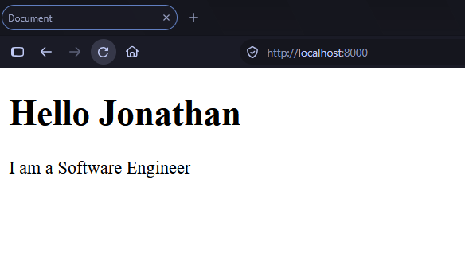
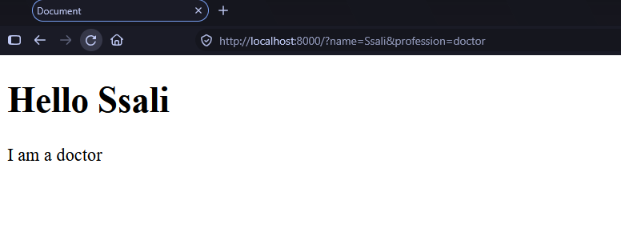
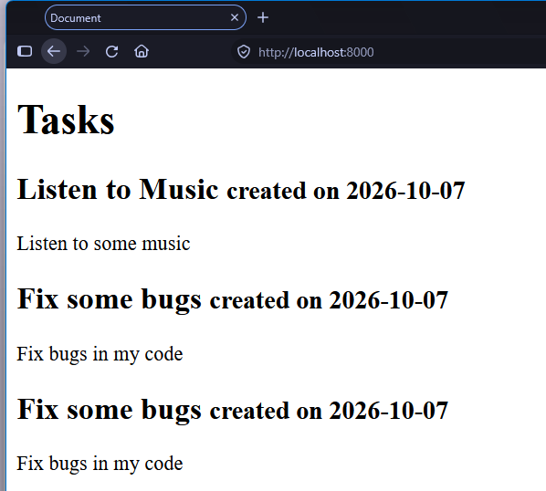
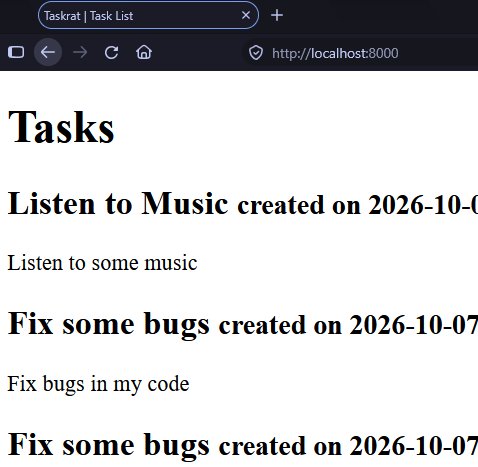
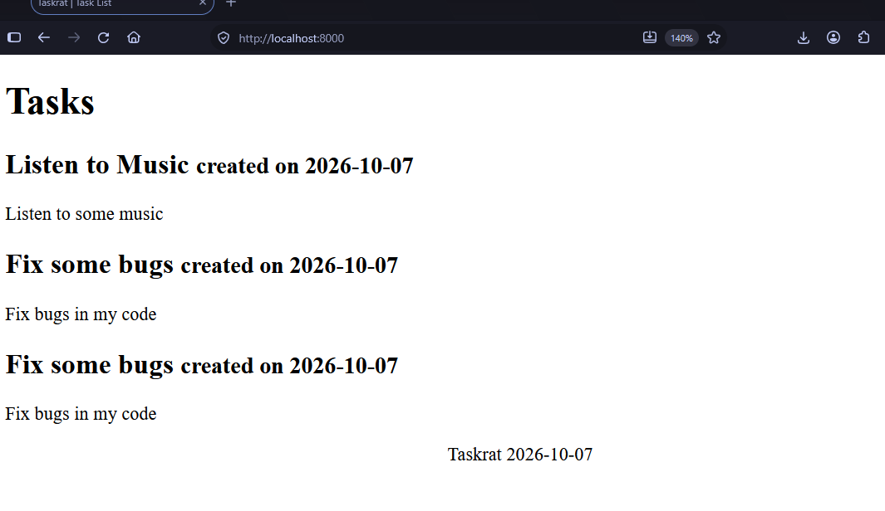
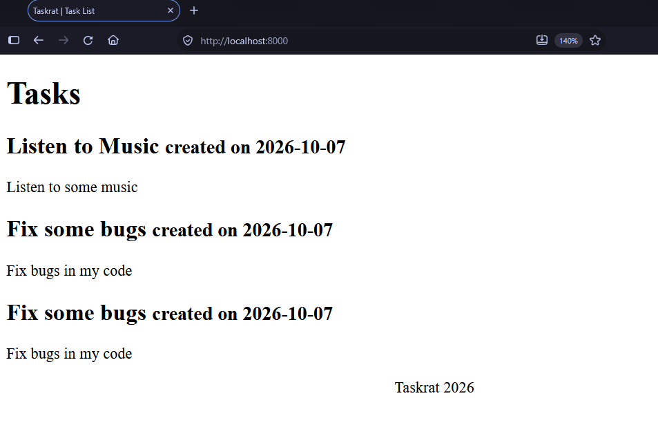
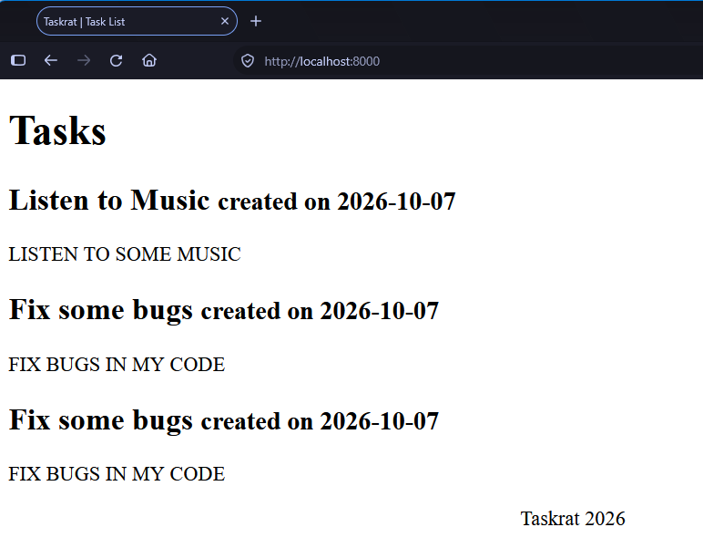
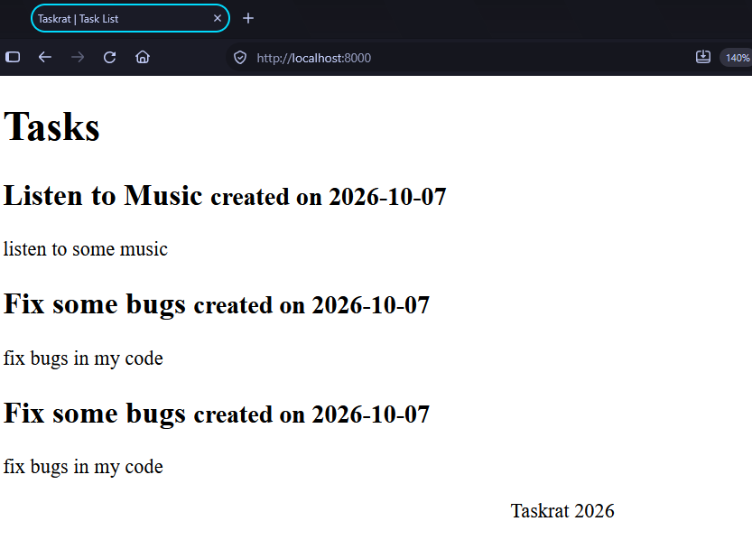
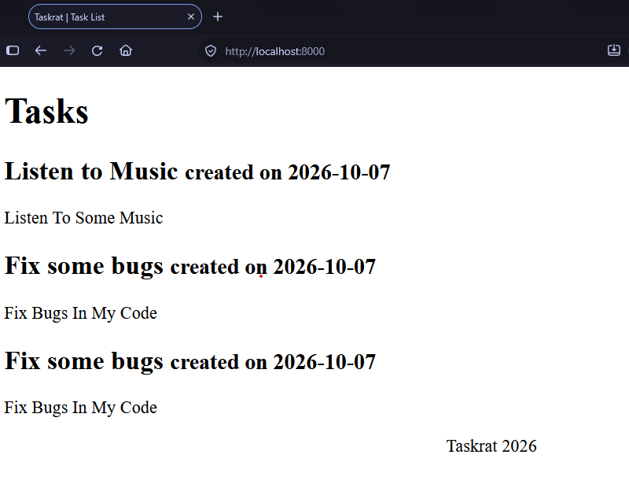

## What are Django templates?

These are basically text files like the index.html we have created. They have special syntax that Django uses to modify the content making it dynamic.

## Variables
We have already added a variable to the template.

```html title=""
<!DOCTYPE html>
<html lang="en">
<head>
    <meta charset="UTF-8">
    <meta name="viewport" content="width=device-width, initial-scale=1.0">
    <title>Document</title>
</head>
<body>
    <h1>Hello {{name}}</h1>
</body>
</html>
```
To add a variable, simply add a key to your context dictionary and use the key to access the value in your template with `{{}}`.

Let us update our view function with more context magic.

```py title="more context vars"
# inside tasks/views.py
def index(request):
    name = request.GET.get("name") or "Jonathan"
    profession = request.GET.get("profession") or "Software Engineer"
    return render(request, "index.html", {"name": name, "profession":profession})
```

Edit the HTML to include this.

```html title="updated index.html"
<!-- inside tasks/templates/index.html -->
<!DOCTYPE html>
<html lang="en">
<head>
    <meta charset="UTF-8">
    <meta name="viewport" content="width=device-width, initial-scale=1.0">
    <title>Document</title>
</head>
<body>
    <h1>Hello {{name}}</h1>
    <p>I am a {{profession}}</p>
</body>
</html>
```

The interesting thing we have done here is to introduce query params for values that we can give to `name` and `profession`. 

By default, your template looks like this.


<figure markdown="span">

{ width="350" }

<figcaption>template with more context vars</figcaption>

</figure>

Introducing query params makes our content more dynamic.

<figure markdown="span">

{ width="350" }

<figcaption>updated template with values from query params</figcaption>

</figure>

## Template Tags
You can also perform programming logic inside your Django template using template tags. Let us start with a simple example. Template tags are always written using the `` syntax.

### The  tag

```py title="adding a list of tasks to the context"
# inside tasks/views.py

tasks = [
    {
        "id": 1,
        "name": "Listen to Music",
        "description": "Listen to some music",
        "due_date": "2026-12-12",
        "priority": "low",
        "created_at": "2026-10-07",
        "updated_at": "2026-10-07",
    },
    {
        "id": 2,
        "name": "Fix some bugs",
        "description": "Fix bugs in my code",
        "due_date": "2026-12-12",
        "priority": "high",
        "created_at": "2026-10-07",
        "updated_at": "2026-10-07",
    },
    {
        "id": 3,
        "name": "Fix some bugs",
        "description": "Fix bugs in my code",
        "due_date": "2026-12-12",
        "priority": "high",
        "created_at": "2026-10-07",
        "updated_at": "2026-10-07",
    },
]

def index(request):
    return render(request, "index.html", {"tasks": tasks})
```

This introduces a dummy list of data which can look like actual database data for our tasks. Let us look at how we can display these in our template.

```html title="updated template with list of tasks"
<!DOCTYPE html>
<html lang="en">
<head>
    <meta charset="UTF-8">
    <meta name="viewport" content="width=device-width, initial-scale=1.0">
    <title>Document</title>
</head>
<body>
    <h1>Tasks</h1>
    
        <div>
            <h2>{{task.name}} <small>created on {{task.created_at}}</small></h2>
            <p>{{task.description}}</p>
        </div>
    
        
</body>
</html>
```

By using the  tag, We have intrduced a `for` loop in our template to iterate on our `tasks` and display the same HTML for tasks that esist in our dummy data. 


<figure markdown="span">

{ width="350" }

<figcaption>Displaying a list of data</figcaption>

</figure>

### The  tag
In case you want to conditionally display something, you can use the `` tag with the condition you wanna check for. 

Update the your view to add the title variable 

```py title="changing the page titles with the if "
# inside tasks/views.py

def index(request):
    title = "Task List"
    return render(request, "index.html", {"title": title,"tasks": tasks})
```

Add the conditional logic to your template

```html title="dynamically display a title"
<!-- tasks/template/index.html -->
<!DOCTYPE html>
<html lang="en">
<head>
    <meta charset="UTF-8">
    <meta name="viewport" content="width=device-width, initial-scale=1.0">
    
    <!--- add this --->
    
        <title>Taskrat | {{title}}</title> 
    

</head>
<body>
    <h1>Tasks</h1>
    
        <div>
            <h2>{{task.name}} <small>created on {{task.created_at}}</small></h2>
            <p>{{task.description}}</p>
        </div>
    
</body>
</html>
```

This will change our title to this.

<figure markdown="span">

{ width="350" }

<figcaption>dynamically displayed title</figcaption>

</figure>

We can also use `` in situations where a condition is false.

```html title="dynamically display a title if condition is false"
<!-- tasks/template/index.html -->
<!DOCTYPE html>
<html lang="en">
<head>
    <meta charset="UTF-8">
    <meta name="viewport" content="width=device-width, initial-scale=1.0">
    

    
        <title>Taskrat | {{title}}</title> 
     <!--- add this --->
        <title>Taskrat</title> 
    
</head>
<body>
    <h1>Tasks</h1>
    
        <div>
            <h2>{{task.name}} <small>created on {{task.created_at}}</small></h2>
            <p>{{task.description}}</p>
        </div>
    
</body>
</html>
```

### The  Tag
This tag will help you display current time in your template. You can also customize it to extract what you want from the current date.

Let us update our template

```html title="The now tag in our template"
<!DOCTYPE html>
<html lang="en">
<head>
    <meta charset="UTF-8">
    <meta name="viewport" content="width=device-width, initial-scale=1.0">

    
    <title>Taskrat | {{title}}</title>
     <!--- add this --->
    <title>Taskrat</title>
    

</head>
<body>
    <main>
        <h1>Tasks</h1>
        
        <div>
            <h2>{{task.name}} <small>created on {{task.created_at}}</small></h2>
            <p>{{task.description}}</p>
        </div>
        
    </main>
    <footer>
        <p align="center">Taskrat </p>
    </footer>
</body>
</html>
```

This will display the current date in our template


<figure markdown="span">

{ width="350" }

<figcaption>displaying current date</figcaption>

</figure>

Let us extract the year out of the date with ``.

```html title="change your footer to include this"
    <footer>
        <p align="center">Taskrat </p>
    </footer>
```

That will display the year part of the current date.

<figure markdown="span">

{ width="350" }

<figcaption>displaying the current year</figcaption>

</figure>

### Comments with 
These are used if you want some template code not to be displayed as part of the template.

```html title="an example comment in a Django template"
     <!--i do not want this -->
        <p>I do not want this code displayed.</p>
    
        
    <main>
        <h1>Tasks</h1>
        
        <div>
            <h2>{{task.name}} <small>created on {{task.created_at}}</small></h2>
            <p>{{task.description}}</p>
        </div>
        
    </main>
```

!!! Note
    There are many tags and I will spend an entire day telling you what each does if I choose to explain them all, refer to the documentation for the [complete tag reference](https://docs.djangoproject.com/en/6.0/ref/templates/builtins/). We shall also explore more as we proceed.

## Filters
Filters are used in templates to modify or format a value before displaying it. They are often used on variables with the syntax of `{{var|filter}}`

Here are some examples we can use

### Converting a string to uppercase
```html title="turn text to uppercase in template"
<p>{{task.description|upper}}</p>
```
<figure markdown="span">

{ width="350" }

<figcaption>display text to uppercase</figcaption>

</figure>

### Converting a string to lowercase
```html title="turn text to lowercase in template"
<p>{{task.description|lowercase}}</p>
```
<figure markdown="span">

{ width="350" }

<figcaption>display text to lowercase</figcaption>

</figure>

### Converting a string to titlecase
```html title="turn text to titlecase in template"
<p>{{task.description|title}}</p>
```
<figure markdown="span">

{ width="350" }

<figcaption>display text to titlecase</figcaption>

</figure>

let us stop here and move to the next chapter. We shall talk about databases.