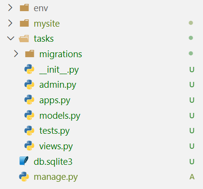
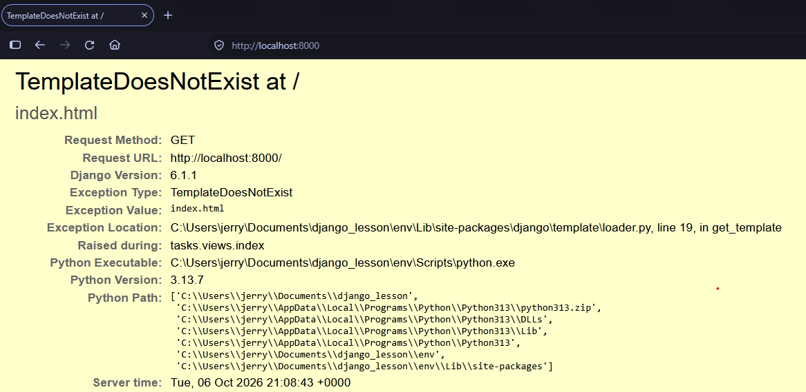
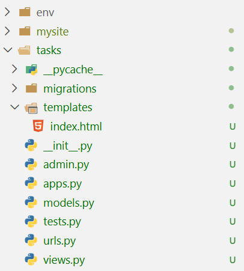
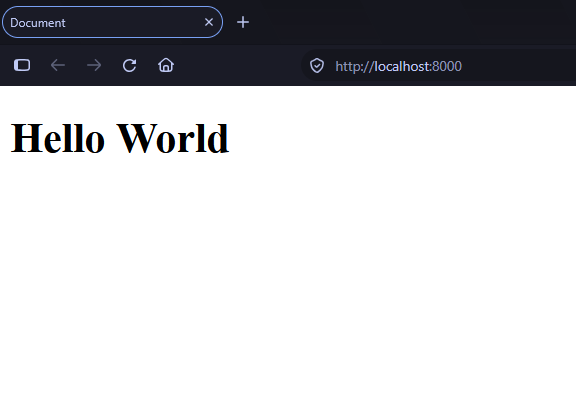
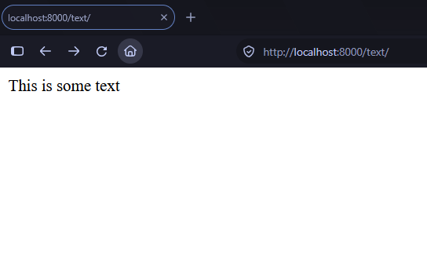
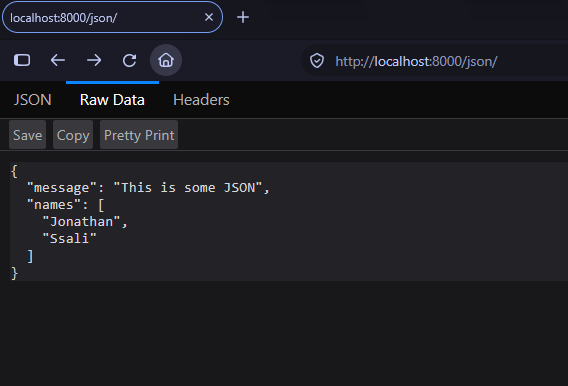
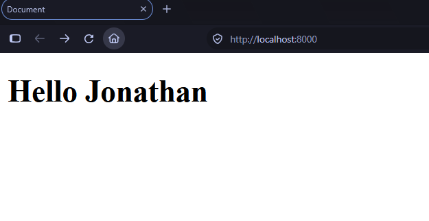

# The Basics

We have created a Django project and now we create an application and get to see Django in action. Let us first understand Django's architecture. How does it work?


## How is Django designed?

- **Loose coupling :** Different components of the framework can work together without depending on each other. They do not have to know the details of each other.

- **Less Code :** Django makes it easy to build a lot with less code. It uses Pythonic approaches to abstract away all the complex tasks.

- **Do not Repeat Yourself :** All distinct concepts and code should live in one place. Redundancy is bad.

You can read more about this [here](https://docs.djangoproject.com/en/6.1/misc/design-philosophies/)

## Main Framework Components
Django follows the **MVT** (Model View Template) pattern which is similar to **MVC** (Model View Controller) pattern. This pattern splits your application into three main components.

- **Models (M) :** This defines the structure of your data for your app and provides ways for you to handle such data between your database and your views.

- **Views (V) :** This communicates with the database through the model, and transfers data to the template.

- **Templates (T) :** This is the presentation layer. Django provides a plain-text template system that renders the HTML your browser views.

With this understanding, we can proceed to create our first application and register it onto our project.

## Creating your first Django application
Your Django app will contain specific functionality. It can be plugged into any other project. Let us create our very first application.

In your command line (with your activated virtual environment), type the following command

```title="creating a Django App"
python manage.py startapp tasks
```
This will create the following folder structure.


<figure markdown="span">

{ width="350" }

<figcaption>Current Project structure with the tasks app</figcaption>

</figure>

The `tasks` app folder is described here:

- `tasks/`: This is the application folder specific to tasks.

    - `__init__.py`: This file tells Python to treat the `tasks` folder as a Python package.

    - `migrations/`: This will keep Django migrations. These track changes to your database models.

    - `models.py`: Your database models live here. These are the classes you use to define the structure of your data. We will look at these later.

    - `views.py` : Here, we shall keep the views, functions or classes responsible for handling all requests made to our Django website.

    - `tests.py` : All automated tests for this app will be written in this file.

    - `apps.py` : This is where the main configuration of your app lives.

## Django Project settings

Our project folder **mysite** contains a file called `settings.py` with a lot of default Django settings. Let us explore these.

- **`DEBUG`**: This is a boolean (True or False) that turns the project's debug mode on or off. When `True`, Django shows detailed error pages; otherwise, they are hidden. It is important to turn this off when the app is in production.

- **`ALLOWED_HOSTS`**: This is a list of domains that Django will allow your website to be accessed on. This will only work when your app is in production with `DEBUG` set to `False`.

- **`INSTALLED_APPS`**: This is a list of applications that will be active for our project. You will edit this as you add apps. Let us review some of the defaults:
    - **django.contrib.admin**: An administration site.
    - **django.contrib.auth**: An authentication framework.
    - **django.contrib.contenttypes**: A framework for handling content types.
    - **django.contrib.sessions**: A session framework.
    - **django.contrib.messages**: A messaging framework.
    - **django.contrib.staticfiles**: A framework for managing static files, such as CSS, JavaScript files, and images.

- **`MIDDLEWARE`**: This is the list of middleware to be executed.
- **`ROOT_URLCONF`**: This describes the location of the main URLs module in your project, `mysite/urls.py` in our case.
- **`DATABASES`**: This is the dictionary where the database is set up.

## Activate an application
For our `tasks` application to work, we have to add it to our project's `INSTALLED_APPS` list together with the apps we have looked at above.

```py title="register your app to INSTALLED_APPS"

# inside mysite/settings.py

INSTALLED_APPS = [
    'django.contrib.admin',
    'django.contrib.auth',
    'django.contrib.contenttypes',
    # ...
    'tasks.apps.TasksConfig' # <- add this
]
``` 

The `TasksConfig` is the class found in `tasks/apps.py` and it is the main application config for the `tasks` app. By adding it to `INSTALLED_APPS`, Django will automatically track its changes and create tables for the models we shall create for it.

```py title="The TasksConfig class"
# inside tasks/apps.py

from django.apps import AppConfig

class TasksConfig(AppConfig):
    name = 'tasks'
```

## Create your first view
A view is a function or class that receives a request (HTTP request), processes it and returns a response (HTTP response). Django lets us define them in the `views.py` file of our applications.

```py title="creating our first view"
# inside tasks/views.py

from django.shortcuts import render

def index(request):
    return render(request, "index.html", {})
```
What we have done here is to create a function `index` that takes in a `request` object. It then returns a call to the `render` function. This uses the request to render an HTML file called `index.html`. We have not created it yet, but we will shortly.

## Mapping Views to URLs

In order for this to work, we shall have to map this view function onto a URL that users will visit on our website to view the page. Let us begin by creating a file in our app called `urls.py`

```py title="URL patterns for the tasks app"
# inside tasks/urls.py

from django.urls import path
from . import views

urlpatterns = [
    path('', views.index, name='index')
]
```

We import a function called `path` which maps a path to a view. We also provide a `name` to the path which will be useful later.

!!! Note
    For your URL patterns to be considered, they need to be in a `urlpatterns` list. Make sure the spelling is exact.

We are not yet done. We need to make the project use the URLs we create in our apps. Remember `mysite/urls.py`? Add this to that file

```py title="register tasks app URLs to the project"
# inside mysite/urls.py

from django.contrib import admin
from django.urls import path, include  # include allows us to import URLs from our apps

urlpatterns = [
    path('admin/', admin.site.urls),
    path('', include('tasks.urls')), # <- add task URLs here
]
```

Open your browser and navigate to `http://localhost:8000`. You will see the following.

<figure markdown="span">

{ width="350" }

<figcaption>No template found</figcaption>
</figure>

Let us now add the HTML file. Create a new folder in the `tasks` app called `templates` and create a file called `index.html`.

<figure markdown="span">

{ width="350" }

<figcaption>Current Project structure</figcaption>

</figure>

Stop the server with **CTRL + C** and start it again. Visiting `http://localhost:8000` will now render our HTML page.

<figure markdown="span">

{ width="350" }

<figcaption>Hello WORLD</figcaption>

</figure>

## More Views

Views can return more than just HTML pages.

```py title="More responses"
# inside tasks/views.py

from django.shortcuts import render
from django.http import HttpResponse, JsonResponse, FileResponse

# Create your views here.
def index(request):
    return render(request, "index.html", {})

def get_text(request):
    """returns some text"""
    return HttpResponse("This is some text")

def get_json(request):
    """returns some JSON"""
    return JsonResponse(
        data={"message": "This is some JSON", "names": ["Jonathan", "Ssali"]}
    )

def download_file(request):
    """returns manage.py"""
    file = open("manage.py", "rb")
    return FileResponse(file, as_attachment=True, filename="manage.py")
```

Let us map these onto URLs and check them out in the browser.

```py title="URLs for the other views"
# inside tasks/urls.py

from django.urls import path
from . import views

urlpatterns = [
    path('', views.index, name='index'),
    path('json/', views.get_json, name='get_json'),
    path('text/', views.get_text, name='get_text'),
    path('file/', views.download_file, name='download_file'),
]
```

Let us start with the text view:


<figure markdown="span">

{ width="350" }

<figcaption>Making the text request</figcaption>

</figure>

The JSON request works like this:

<figure markdown="span">

{ width="350" }

<figcaption>Making a JSON request</figcaption>

</figure>

It is common to render HTML but I thought I would first show you the different responses you can return.

## The render function

We used the `render` function to display an HTML page when users visit the root of our website. Let us look at it in more detail. 

```py title="the render function"
# inside tasks/views.py

from django.shortcuts import render

def index(request):
    return render(request, "index.html", {})
```

The function takes in 3 main arguments. 

- `request`:  This is the request object coming from your view function.
- `template_name`: This is the name of the HTML file you want to render.
- `context`: This is a dictionary with values we want to display in the template.

Let us make use of the `context` dictionary to transform our HTML file into a template.

```py title="adding template context"
# inside tasks/views.py

def index(request):
    return render(request, "index.html", {"name": "Jonathan"})
```

We have added a `name` variable with a value of "Jonathan" to the template. We can use Django's templating system to dynamically display this variable in the template.

Let Us edit our `index.html` file 

```py title="adding template variables"
<!DOCTYPE html>
<html lang="en">
<head>
    <meta charset="UTF-8">
    <meta name="viewport" content="width=device-width, initial-scale=1.0">
    <title>Document</title>
</head>
<body>
    <h1>Hello {{name}}</h1>
</body>
</html>
```

Checking this out in our browser will look like this.  

<figure markdown="span">

{ width="350" }

<figcaption>Displaying a dynamic value in a template</figcaption>

</figure>

Let us end this chapter here. Next, we shall look at templates in detail.